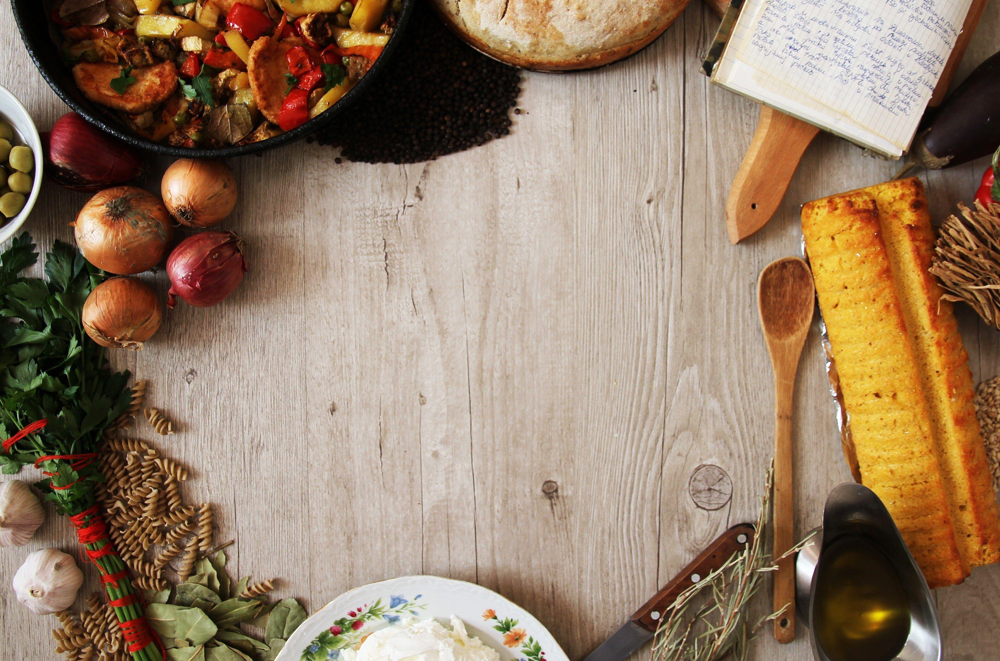
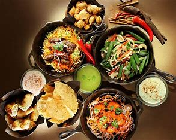
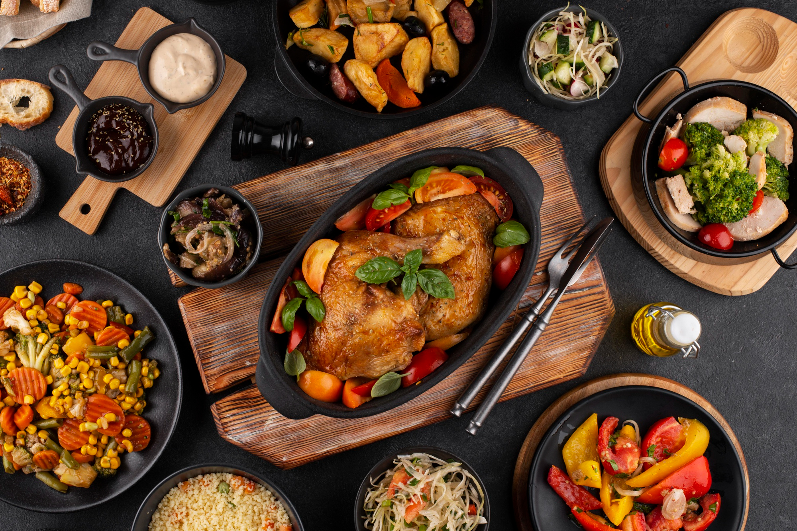
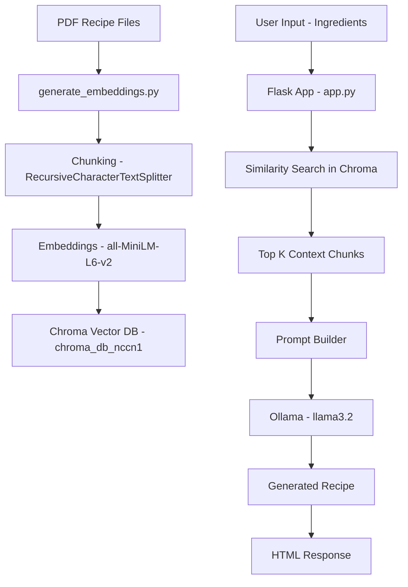
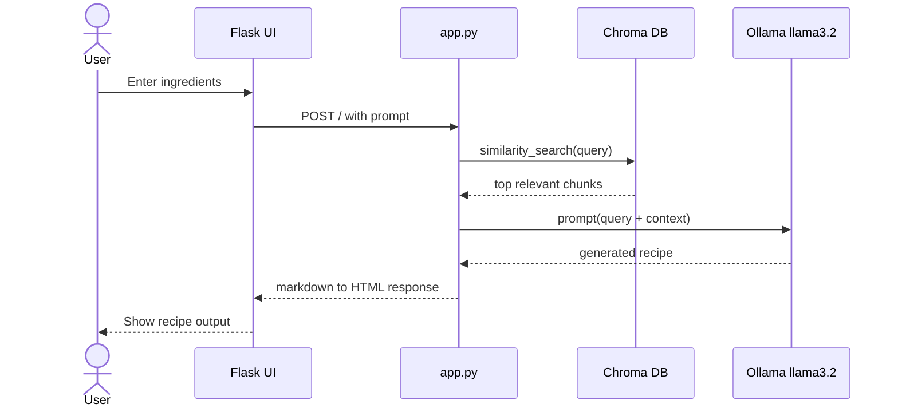

# COOK.IT - Local RAG Recipe Assistant

COOK.IT is a simple Retrieval-Augmented Generation (RAG) project.
You enter ingredients, the app retrieves relevant recipe content from PDF books, and a local LLM (Ollama + llama3.2) generates the final answer.

This project does **not** use fine-tuning.
It uses retrieval + prompt + generation.

## Project Idea

The goal is to build an RAG system with:

- Local document knowledge (PDF recipe books)
- Fast semantic search using vector embeddings
- Local answer generation using Ollama (no billing needed)
- Simple Flask UI

## Project Preview


## Image Gallery








## Tech Stack

- Python
- Flask (web app)
- LangChain components
- Hugging Face embeddings: `sentence-transformers/all-MiniLM-L6-v2`
- Chroma vector database (local persistence)
- Ollama (`llama3.2`) for local text generation
- HTML/CSS/Bootstrap frontend

## Architecture Flow

### Offline indexing flow (one-time or when PDFs change)

1. `generate_embeddings.py` loads PDF files.
2. Text is split into chunks.
3. Each chunk is converted to an embedding vector.
4. Vectors are saved to local Chroma DB at `./chroma_db_nccn1`.

### Online query flow (every user request)

1. User enters ingredients in UI.
2. `app.py` retrieves top similar chunks from Chroma.
3. Retrieved chunks are inserted into the prompt as context.
4. Prompt is sent to Ollama (`llama3.2`).
5. Model returns answer shown in UI.

## Architecture Diagram



## Runtime Sequence Diagram



## Is This RAG or Fine-tuning?

This is **RAG**.

- RAG: fetches external knowledge at runtime (your PDF chunks)
- Fine-tuning: changes model weights by training

In this project, model weights are not trained or changed.

## File-by-File Explanation

- `generate_embeddings.py`
  - Builds the vector database from PDFs.
  - Run this when you add/remove/update PDFs.

- `app.py`
  - Loads embedding model and vector DB.
  - Retrieves relevant context for a user query.
  - Sends prompt to Ollama and returns response.

- `templates/index.html`
  - Input form + output display.

- `static/sty.css`
  - Styling.

## Setup

### 1. Create and activate virtual environment

```powershell
python -m venv .venv
.venv\Scripts\Activate.ps1
```

### 2. Install dependencies

```powershell
pip install flask markdown torch requests langchain-huggingface langchain-text-splitters langchain-community langchain-chroma chromadb sentence-transformers pypdf
```

### 3. Ensure Ollama model is available

```powershell
ollama run llama3.2
```

### 4. Build vector database

```powershell
python generate_embeddings.py
```

### 5. Run app

```powershell
$env:OLLAMA_MODEL="llama3.2"
python app.py
```

Open: `http://127.0.0.1:5000`

## Interview Explanation (Short Version)

"This is a local RAG recipe assistant. I ingest recipe PDFs, chunk and embed them with a sentence-transformer, store vectors in Chroma, retrieve top relevant chunks for a query, and pass that context to a local Ollama LLM (llama3.2) to generate grounded answers."

## Interview Topics Covered

- RAG pipeline design
- Embeddings and semantic similarity search
- Vector databases (Chroma)
- Prompt grounding with retrieved context
- Local LLM inference with Ollama
- Flask backend integration

## Important Points to Explain in Interview

1. Why RAG is used:
  LLM alone may hallucinate. RAG adds document-grounded context before generation.

2. Why embeddings are needed:
  Exact keyword search is weak for natural language. Embeddings allow semantic similarity search.

3. Why Chroma is used:
  It stores vectors locally and supports fast nearest-neighbor retrieval for each query.

4. Why local LLM (Ollama):
  No API billing dependency, works offline, and is easy to demo in interviews.

5. Core trade-off:
  Local models are cheaper and private, but may be less accurate than larger cloud models.

6. Hallucination control strategy:
  Use strict prompts, lower temperature, smaller context window, and source citation.

7. Separation of concerns:
  `generate_embeddings.py` handles indexing, while `app.py` handles query-time retrieval and generation.

8. Scalability thought:
  For larger corpora, improve chunk strategy, add metadata filters, and cache frequent queries.

9. Evaluation idea:
  Measure retrieval quality (top-k relevance) separately from generation quality.

10. Production readiness gaps:
  Add authentication, logging, monitoring, rate limits, and containerized deployment.

## Quick 60-Second Interview Pitch

"I built a local RAG recipe assistant using Flask, Chroma, sentence-transformer embeddings, and Ollama llama3.2. I first index recipe PDFs into vector embeddings. At runtime, the app retrieves top relevant chunks for a user query and injects them into the prompt. The local LLM generates a grounded response, which is rendered in the UI. This gives better domain relevance than plain prompting and avoids cloud API billing."

## Common Questions You May Get

### Why does the model sometimes add extra details?

Because generation models can infer beyond context. To reduce this, use stricter prompts, lower temperature, and source citations.

### How do you know it uses PDF content?

Because the app retrieves from Chroma built from PDF chunks before generation. The model receives those chunks inside the prompt context.

### Can this work without internet?

Yes, for generation and retrieval (if Ollama model is already downloaded and local files exist).

## Next Improvements

- Add source citations (file/page) in output.
- Add "strict grounded mode" to block unsupported claims.
- Add evaluation script for retrieval quality.
- Add Docker support for easier setup.
- Add `requirements.txt` for one-command install.
